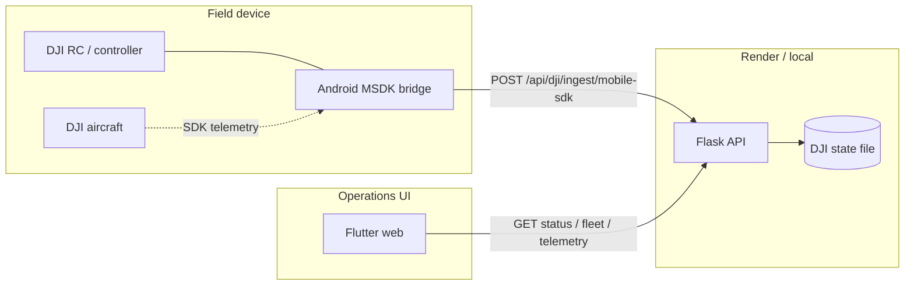

# Mobile SDK Android Bridge

End-to-end guide for the FireDrone DJI Mobile SDK field bridge.

## System diagram



## Roles

| Component | Responsibility |
|-----------|--------------|
| Android bridge | Read aircraft state (stub or DJI SDK), POST normalized JSON with Bearer token |
| Flask backend | Map Mobile SDK JSON → internal ingest payload, persist state, expose read APIs |
| Flutter web | Display fleet/telemetry; configure ingest token via Connect DJI dialog |

The Flutter web app does **not** talk to DJI hardware directly.

## Ingest contract

**Endpoint:** `POST {api_base}/dji/ingest/mobile-sdk`

**Headers:**

```http
Authorization: Bearer <DJI_INGEST_TOKEN>
Content-Type: application/json
```

**Body (Mobile SDK shape):** see `backend/scripts/post_mobile_sdk_state.py` sample and `backend/app/dji/mobile_sdk.py` mapping.

**Success:** HTTP `202` with JSON containing `"source": "mobile-sdk-bridge"`.

## Generate an ingest token

**Option A — Flutter Connect DJI**

1. Open Live Simulator → Connect DJI → Mobile SDK.
2. Click **Generate token** or paste an existing token.
3. Save connection (writes runtime config on the backend).

**Option B — API**

```bash
curl -X POST http://127.0.0.1:5000/api/dji/connection/token
```

Use the returned token as `DJI_INGEST_TOKEN` in backend `.env` / Render env and in the Android app.

## Local development

**Terminal 1 — backend**

```bash
cd backend
# .env: DJI_INGEST_TOKEN=your-token, ALLOW_DJI_COMMANDS=false
python run.py
```

**Terminal 2 — Python smoke test (no Android)**

```bash
cd backend
DJI_INGEST_TOKEN=your-token python scripts/post_mobile_sdk_state.py --sample \
  --api-base http://127.0.0.1:5000/api
```

**Terminal 3 — Android stub bridge**

1. Open `mobile_sdk_bridge/android` in Android Studio.
2. Set API base to `http://10.0.2.2:5000/api` (emulator) or `http://<host-lan-ip>:5000/api` (device).
3. Enter the same ingest token → Save → Start posting.

**Terminal 4 — Flutter web (optional)**

Point the Flutter app at `http://127.0.0.1:5000/api` and confirm fleet/telemetry update.

## Production (Render)

| Setting | Value |
|---------|-------|
| API base | `https://firedrone-api.onrender.com/api` |
| Ingest token | Same `DJI_INGEST_TOKEN` configured on Render backend |

Verify:

```bash
DJI_INGEST_TOKEN=your-token python backend/scripts/post_mobile_sdk_state.py --sample \
  --api-base https://firedrone-api.onrender.com/api
```

Then run the Android app against the same base URL and token.

## Expected backend status

After a successful ingest:

```json
{
  "connection": "bridge-online",
  "liveData": true,
  "bridge": {
    "adapter": "mobile-sdk",
    "deviceId": "rc-pro-001"
  },
  "source": "mobile-sdk-bridge"
}
```

## Backend tests

No backend changes are required for Phase A. Run existing tests:

```bash
cd backend
python -m unittest discover -s tests
```

Key test: `test_mobile_sdk_ingest_maps_aircraft_and_flight_state` in `backend/tests/test_dji_api.py`.

## Safety constraints

- `ALLOW_DJI_COMMANDS=false` always for this bridge path.
- Bridge ingest updates monitoring state only — no command dispatch.
- Do not commit `.env`, DJI keys, ingest tokens, or `backend/instance/`.

## Implementation phases

| Phase | Status | Description |
|-------|--------|-------------|
| A | Done | Android stub posting sample payload on interval |
| B | Planned | DJI Mobile SDK V5 integration + field mapping |
| C | Done | This doc + `mobile_sdk_bridge/README.md` |

See also [DJI_REAL_INTEGRATION.md](DJI_REAL_INTEGRATION.md) Mobile SDK section.
